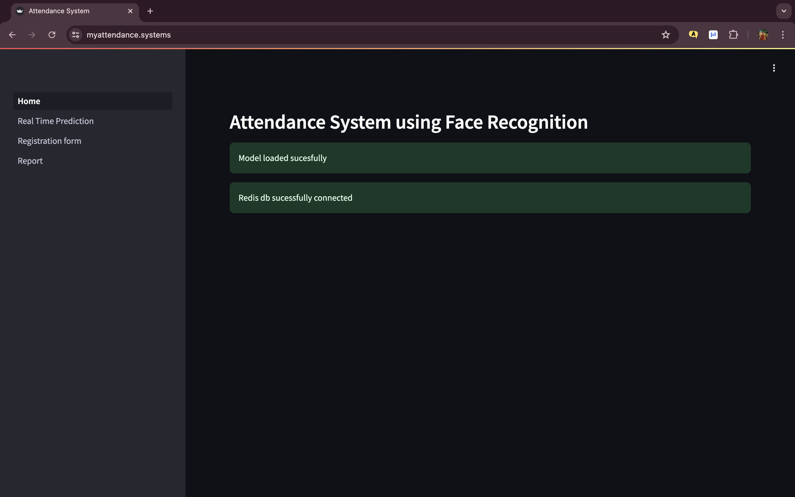
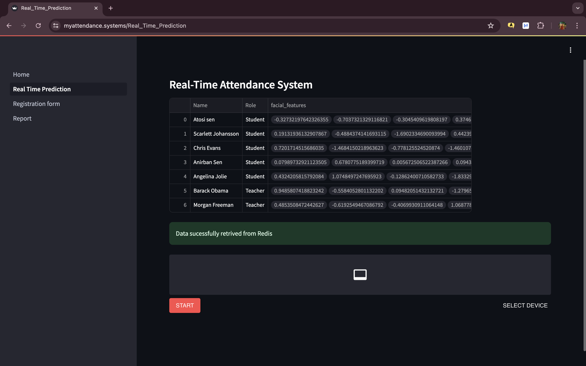
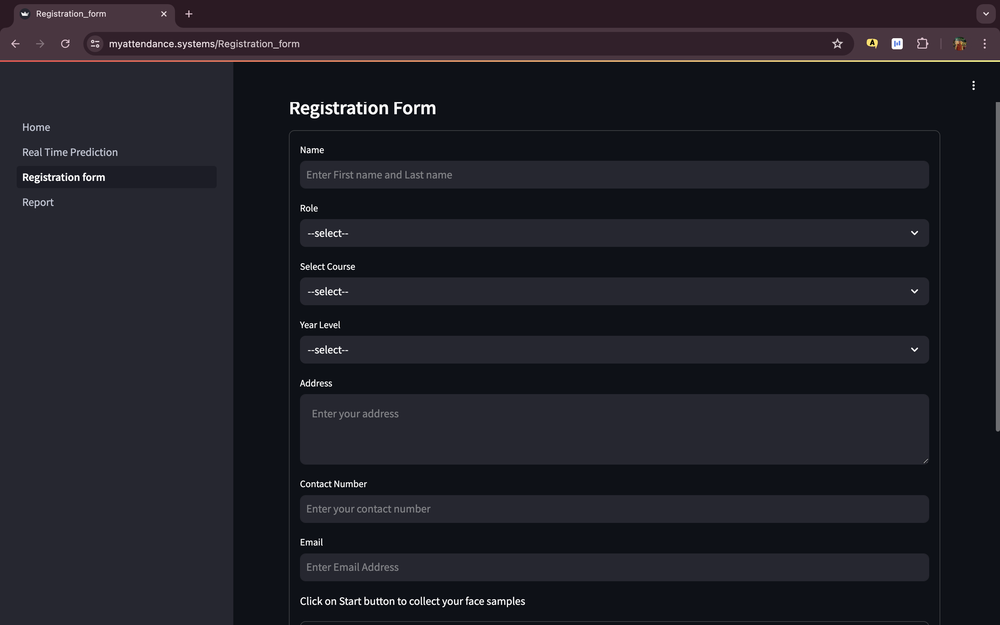
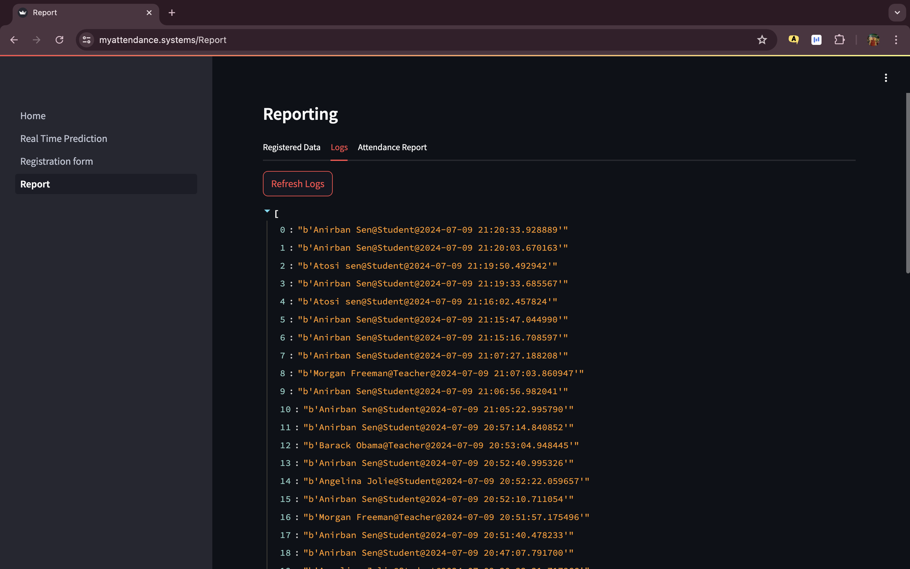
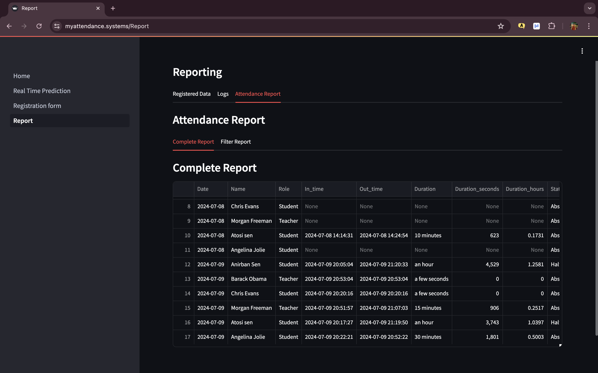
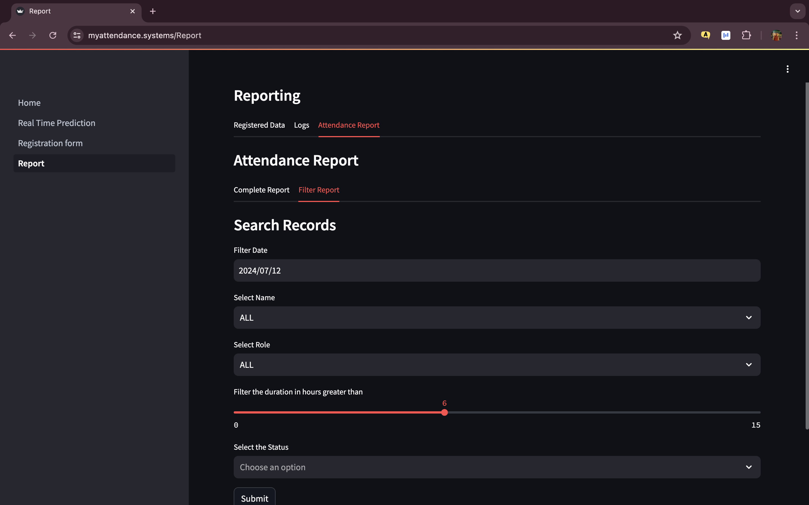

vAttendance-System-App

The Face Recognition Attendance System is a web application that uses advanced facial recognition to automate attendance tracking. Deployed on AWS, it offers high accuracy, real-time processing, and secure data storage. Users benefit from a user-friendly interface, making attendance management efficient and contactless.

# IMAGES
📸  Home Page 
📸  Attendance Page  
📸  Registration Page 
📸  Report Page
📸 
📸 

# LIVE SITE
🔗 Check out the live version <a href="https://myattendance.systems/" target="_blank">here</a>

Revolutionize attendance with this Project : Secure, accurate, and seamless facial recognition.
